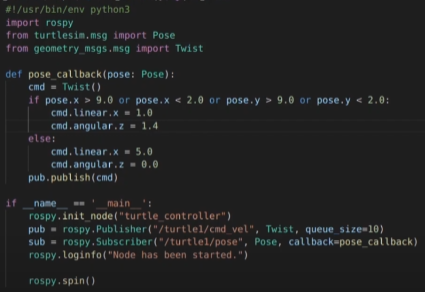

# ROS

## ROS components

### Nodes
A node is a process that performs computations.

### Messages
Nodes communicate with each other by passing messages. A message is a data structure. Standard primitive types are supported, as well as arrays of primitive types. They can include nested structures and arrays.

### Topics
Messages are routed via a transport system with publish/subscribe semantics. A node sends a message by publishing it to a given topic. The topic is a name that is used to identify the content of the message. A node that is interested in a certain kind of data will subscribe to the appropriate topic.

### Services
The publish/subscribe model is not appropriate for request/reply interactions. Request/reply is done via services, which are defined by a pair of message structures: one for the request and one for the response. A providing node offers a service under a name and a client uses the service by sending the request message and awaiting the reply.

### Actions
Actions are useful to perform request/reply interactions when we have tasks that requires a certain period of time and we want to monitor them. We can have continuous feedback and cancel the request during the task execution.

We can use the _ActionLib_ package to implement:
- _servers_ that execute (preemptable) long-running tasks;
- _clients_ that interact with servers.

The action client provvides the topics:
-  _goal_: sends new goals to the server;
-  _cancel_: sends cancel requests to the server.

The action server provvides the topics:
- _status_:  notifies clients on the current state
of every goal in the system;
- _result_: sends to clients one-time auxiliary
information about the completion of a goal;
- _feedback_: sends to clients periodic auxiliary
information about a goal.

### Launch files
_roslaunch_ is a tool for easily launching multiple ROS nodes locally, as well as setting parameters on the Parameter Server.
roslaunch takes in one or more _XML_ configuration files that specify the parameters to set and nodes to launch.

### Rviz
It's a 3-dimensional visualization tool for ROS. It allows the user to view the simulated robot model, log sensor information from the robot's sensors, and replay the logged sensor information.
Rviz initializes three nodes:
- *joint_state_publisher*;
- *robot_state_publisher*;
- *rviz*.

### Gazebo
Is the 3D simulator for ROS. The robot may be controlled using ROS topics. When moving the robot around, information coming from sensors may be visualized in Rviz.

## ROS package structure

In the package directory:
   - _Cpp_ files go in the `/src` folder;
   - _Python_ files go in the `/scripts` folder;
   - Costum mesagges files go in the `/msg` folder with the _.msg_ extension;
   - Costum services files go in the `/srv` folder with the _.srv_ extension;
   - Costum action files go in the `/action` folder with the _.action_ extension;
   - Launch files go in the `/launch` folder with the _.launch_ extension;

## Basic ROS commands

#### Create ROS package

```sh
> catkin_create_pkg <package_name> <depend1> <depend2> ...
```

#### Build ROS package

```sh
> catkin_make
```

#### Refresh package list

```sh
> rospack profile
```

#### Run master
```sh
> roscore
```

#### Run a node

```sh
> rosrun <package_name> <node_name> <arg1> <arg2> ...
```

#### Run a launch file

```sh
> roslaunch <package_name> <filename>.launch
```

#### Display a graph of the nodes and topics

```sh
> rosrun rqt_graph rqt_graph
```

#### Show nodes and info on a specific node

```sh
> rosnode list
> rosnode info <node_name>
```

#### Show topics and info on a specific topic

```sh
> rostopic list
> rostopic info <topic_name>
> rostopic echo <topic_name>
> rostopic type <topic_name>
```

#### Record and play a topic

```sh
> rosbag record <topic_name>
> rosbag play <filename>.bag
```

#### Show info on a specific message
```sh
> rosmsg show <msg_name>
```

#### Services commands

```sh
> rosservice list
> rosservice call <service> <arg1> ...
> rosservice type <service>
> rossrv show <service>
```

#### ROS parameters commands

```sh
> rosparam list
> rosparam set <param_name>
> rosparam get <param_name>
> rosparam load <filename>.yaml
> rosparam delete <param_name>
```

## Python code snippets

#### Useful imports
```py
import rospy
from msg_name.msg import Type_msg
from srv_name.srv import Type_srv
```

#### Get parameter from launch file
```py
var = rospy.get_param("/param")
```

#### Publisher subscriber in closed loop example



## CPP code snippets

#### Useful imports
```cpp
#include "ros/ros.h"
#include "srv_name/Type_srv.h"
#include "msg_name/Type_smg.h"
```

#### Get parameter from launch file
```cpp
int var;
ros::param::get("/param", var);
```

#### Service server and pub/sub syntax

```cpp
void sub_callback(const std_msgs::String::ConstPtr& msg)
{
   ROS_INFO("%s", msg->data.c_str());
}

bool srv_callback (pkg_name::Service_name::Request &req, pkg_name::Service_name::Response &res)
{
   // Code to set response values and get request variables
   return true;
}

int main(int argc, char **argv)
{
   // Initialize node
   ros::init(argc, argv, "node_name");
   ros::NodeHandle nh;

   // Define publisher and subscriber
   pub = nh.advertise<msg_name::Type_msg>("my/topic",1);
   ros::Subscriber sub = nh.subscribe("my/other_topic", 1, sub_callback);

   // Define service server
   ros::ServiceServer srv = nh.advertiseService("/service", srv_callback);

   // Define service client
   ros::ServiceClient client =  nh.serviceClient<srv::Type>("/srv");

   srv::Type srv_req;
   srv_req.request.var_name = "value";

   client.call(srv_req);

   ros::spin();

   return 0;
}
```

## Launch file code snippet

```xml
<launch>
   <include file=$(find pkg-name)/path/filename.xml />

   <arg name="var" />

   <node name="node_name" pkg="pkg_name" type="node_file.py" output="screen">
      <remap from="/topic" to="/another_topic"/>

      <param name="param_name" type="int" value="$(arg var)" />

      <rosparam command="load" file="$(find rosparam)/params.yaml" />
      <rosparam command="delete" param="my/param" />
   </node>
</launch>
```

#### Other code snippets
[Example of a client/server architecture (Both in Python and cpp).](https://github.com/CarmineD8/code)

[Reposity for more complete examples (Both in Python and cpp).](https://github.com/CarmineD8/turtlebot_controller)

### References
Reseach Track 1 course - UNIGE
Professor: Carmine Recchiuto